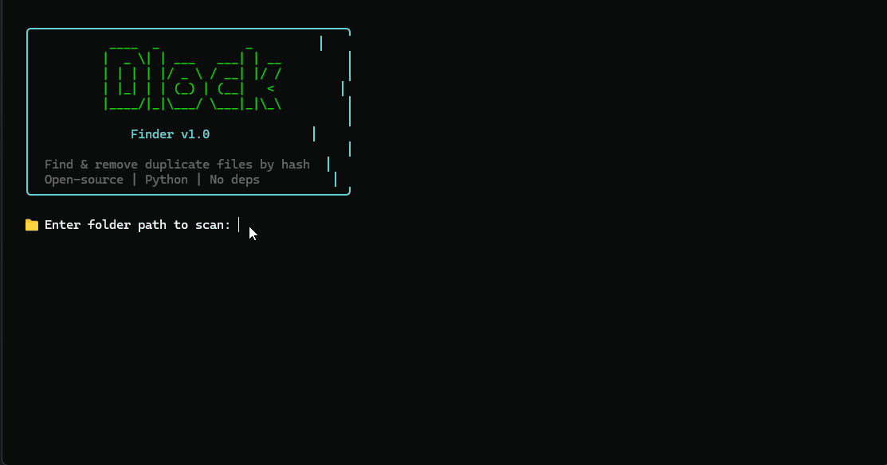

# 🔍 Dlock File Finder




### Find & remove duplicate files by content hash — not by name.

*Open-source • Python • Zero dependencies • Color-coded terminal UI*

---

## 📖 About

Ever downloaded the same movie twice? Backed up photos into 3 different folders? Copied a project "just in case" five times? 🗂️

**Dlock File Finder** is a clean, lightweight command-line utility that scans any folder (or entire drive) and finds **identical files** — even if their names are completely different. It compares files by their **digital fingerprint (MD5 hash)**, not by name, and can safely remove the extra copies to free up disk space. 💾✨

### 🤔 Why?

Most duplicate cleaners are 💰 paid, 📢 bloated with ads, or 🔒 closed-source. This is a transparent, free, and open-source alternative that runs anywhere Python does.

---

## ✨ Features

| | Feature | Description |
|---|---|---|
| 🧬 | **Content-based detection** | Finds duplicates even if filenames are totally different |
| ⚡ | **Two-stage algorithm** | Groups by file size first, then hashes only candidates — blazing fast |
| 🛡️ | **Safe deletion** | Always keeps one original per group, removes only extra copies |
| 👀 | **Dry-run mode** | Preview what would be deleted before touching anything |
| 📊 | **Progress bar** | See hashing progress in real time |
| 🎨 | **Color-coded output** | Clean, readable terminal UI with ANSI colors |
| 📦 | **Zero dependencies** | Uses only Python standard library (`hashlib`, `os`, `argparse`) |
| 🖱️ | **Two modes** | Interactive (double-click) or full command-line |

---

## 🔧 Requirements

- 🐍 **Python 3.6+**
- 🚫 No pip installs needed — just run it!

---

## 🚀 Usage

### 🖱️ Interactive mode (double-click)

Just run the script without arguments — it will guide you through everything:

```bash
python "Dlock File Finder.py"
```

It prompts you for a folder path and a mode choice. Simple as that! 👇

### ⌨️ Command-line mode

```bash
python "Dlock File Finder.py" <path> [options]
```

**Options:**

| 🏷️ Flag | 📝 Description |
|---|---|
| `<path>` | 📁 Directory path to scan (required in CLI mode) |
| `--delete` | 🗑️ Delete duplicates after scanning (with confirmation) |
| `--dry-run` | 👀 Show what would be deleted without actually deleting |
| `--yes` | ✅ Skip confirmation prompt (use with `--delete`) |

**Examples:**

```bash
# 🔍 Scan only — find duplicates, don't delete anything
python "Dlock File Finder.py" "C:\Users\me\Downloads"

# 🗑️ Find and delete with confirmation prompt
python "Dlock File Finder.py" "C:\Users\me\Downloads" --delete

# ✅ Find and delete automatically (no prompt)
python "Dlock File Finder.py" "~/Downloads" --delete --yes

# 👀 Preview what would be deleted (dry run)
python "Dlock File Finder.py" "~/Downloads" --delete --dry-run
```

---

## 🧠 How it works

```
  ┌──────────────────────────────────────────────────┐
  │  📁 SCAN DIRECTORY                               │
  │  Walk all files recursively                      │
  └────────────────────┬─────────────────────────────┘
                       ▼
  ┌──────────────────────────────────────────────────┐
  │  ⚡ STAGE 1: GROUP BY SIZE                       │
  │  Files with different sizes can't be duplicates  │
  │  → Instantly skip unique-sized files             │
  └────────────────────┬─────────────────────────────┘
                       ▼
  ┌──────────────────────────────────────────────────┐
  │  🧬 STAGE 2: HASH BY CONTENT                     │
  │  Compute MD5 only for files sharing a size       │
  │  Group by (size, hash)                           │
  └────────────────────┬─────────────────────────────┘
                       ▼
  ┌──────────────────────────────────────────────────┐
  │  📊 REPORT & 🗑️ DELETE                          │
  │  Show groups, wasted space                       │
  │  Keep first file, remove the rest                │
  └──────────────────────────────────────────────────┘
```

---

## 📸 Example output

```
  ╭────────────────────────────────────────────╮
  │           ____  _            _             │
  │          |  _ \| | ___   ___| | __         │
  │          | | | | |/ _ \ / __| |/ /         │
  │          | |_| | | (_) | (__|   <          │
  │          |____/|_|\___/ \___|_|\_\         │
  │                                            │
  │              Finder v1.0                   │
  │                                            │
  │  Find & remove duplicate files by hash     │
  │  Open-source | Python | No deps            │
  ╰────────────────────────────────────────────╯

  📁 Enter folder path to scan: C:\Users\me\Downloads
  ⚙️ Select mode:
    1 — 🔍 Scan only (find duplicates, no deletion)
    2 — 🗑️ Scan & delete (keep originals, remove dupes)
  Choice [1/2] (default: 1): 1

  📁 Scanning: C:\Users\me\Downloads
  📂 Collecting file list...
  📊 Found 6 files
  🔐 Hashing files with matching sizes...

  ⏳ [████████████████████████████████] 100% (5/5)

  ⏱️ Scan completed in 0.00s

╭────────────────────────────────────────────────────────╮
│              🔍  FOUND 2 DUPLICATE GROUPS              │
╰────────────────────────────────────────────────────────╯

  ┌─ Group 1  │  📄 3 files  │  1.1 KB each
  │  ✅ KEEP  C:\...\trip_video.txt  (original)
  │  ❌ DUPE  C:\...\vacation_2024.txt
  │  ❌ DUPE  C:\...\random_file.txt
  └─  💾 Wasted: 2.1 KB

  ┌─ Group 2  │  📄 2 files  │  615.0 B each
  │  ✅ KEEP  C:\...\favorite_song.txt  (original)
  │  ❌ DUPE  C:\...\song_backup.txt
  └─  💾 Wasted: 615.0 B

  ╭────────────────────────────────────────────────────╮
  │  📊 Summary                                        │
  ├────────────────────────────────────────────────────┤
  │  🔸 Duplicate groups  : 2                          │
  │  🔸 Total dupes       : 3                          │
  │  🔸 Reclaimable space : 2.7 KB                     │
  ╰────────────────────────────────────────────────────╯
```

---

## 📄 License

**MIT License** — free to use, modify, and distribute. 🎉

Made with 💚 and Python
